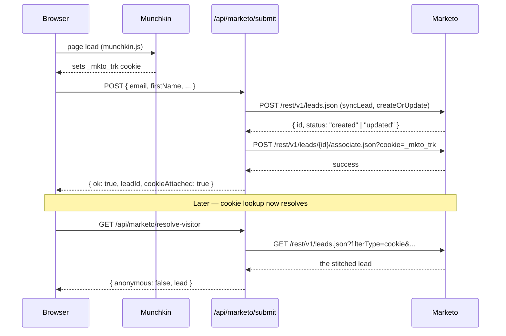

# Lattice — Marketo Landing Page

A Next.js 14 + TypeScript + Tailwind landing page for a fintech business
("Lattice") with full Marketo integration, authenticated purely with your
OAuth client credentials — no Munchkin private key, no Marketo Form ID:

- Munchkin tracking enabled by default (no consent gate — dev site only).
- A custom-styled lead form that upserts a lead by email **and** stitches
  the visitor's `_mkto_trk` cookie to it in two REST calls.
- A `/api/marketo/resolve-visitor` endpoint that resolves the visitor's
  `_mkto_trk` cookie to a Marketo lead.

---

## 1. Install

```bash
npm install
```

## 2. Configure Marketo credentials

```bash
cp .env.local.example .env.local
```

```env
# Admin → Munchkin
NEXT_PUBLIC_MUNCHKIN_ID=XXX-XXX-XXX

# Admin → Web Services
MARKETO_BASE_URL=https://XXX-XXX-XXX.mktorest.com
MARKETO_CLIENT_ID=...
MARKETO_CLIENT_SECRET=...
```

That's it. Four env vars. `NEXT_PUBLIC_MUNCHKIN_ID` is exposed to the
browser by design; everything else stays on the server.

## 3. Run

```bash
npm run dev
```

Open http://localhost:3000.

---

## How the Marketo wiring works

### Munchkin tracking (track by default)

[`app/components/MunchkinScript.tsx`](app/components/MunchkinScript.tsx)
loads `https://munchkin.marketo.net/munchkin.js` via `next/script` and runs:

```ts
Munchkin.init(process.env.NEXT_PUBLIC_MUNCHKIN_ID!, {
  cookieAnon: true,   // tracks anonymous visitors immediately
  domainLevel: 2,
  clickTime: 0,
  asyncOnly: true,
});
```

`cookieAnon: true` is what causes Munchkin to set the `_mkto_trk` cookie on
the very first page load. No consent gate. Mounted once globally in
[`app/layout.tsx`](app/layout.tsx).

### REST client ([`lib/marketo.ts`](lib/marketo.ts))

- `getAccessToken()` — OAuth2 `client_credentials` flow. Tokens cached in
  module scope, refreshed 60s before expiry.
- `marketoFetch()` — bearer-auth fetch wrapper with transparent retry on
  Marketo error codes `601` / `602`.
- `getLeadByCookie(cookie)` — `GET /rest/v1/leads.json?filterType=cookie`.
- `syncLead(fields)` — `POST /rest/v1/leads.json` with
  `action=createOrUpdate` & `lookupField=email`. Upserts.
- `associateLeadByCookie(leadId, cookie)` — `POST
  /rest/v1/leads/{id}/associate.json?cookie=...`. Attaches `_mkto_trk`.
- `upsertAndAssociate(fields, cookie)` — convenience that does both.

### API routes

| Route | Method | Purpose |
| --- | --- | --- |
| `/api/marketo/token` | GET | **Dev only.** Redacted OAuth token + expiry. Disabled in production. |
| `/api/marketo/resolve-visitor` | GET | Reads `_mkto_trk` from request cookies and looks up the lead. Returns `{ anonymous, lead? }`. |
| `/api/marketo/submit` | POST | Validates the form payload, calls `upsertAndAssociate(fields, cookie)`. Used by the on-page form. |

### Flow



---

## Quick verification checklist

After `npm run dev`:

```bash
# 1. OAuth creds work
curl -s http://localhost:3000/api/marketo/token | jq

# 2. Open http://localhost:3000 in the browser to let Munchkin set _mkto_trk.

# 3. Submit the "Request a demo" form with a real work email.
#    Response: { "ok": true, "status": "created" | "updated",
#                "leadId": 12345, "cookieAttached": true }

# 4. Resolve yourself — wait ~30s for Marketo to index, then:
curl -s "http://localhost:3000/api/marketo/resolve-visitor" \
  --cookie "_mkto_trk=<paste from devtools>" | jq
#    → { "anonymous": false, "lead": { "id": 12345, "email": "...", ... } }
```

---

## File map

```
app/
  api/marketo/
    token/route.ts            # dev-only OAuth health check
    resolve-visitor/route.ts  # _mkto_trk → lead lookup
    submit/route.ts           # upsertAndAssociate for the on-page form
  components/
    MunchkinScript.tsx        # loads munchkin.js, cookieAnon: true
    MarketoForm.tsx           # custom-styled lead form
    sections/                 # landing page sections
  layout.tsx                  # mounts MunchkinScript globally
  page.tsx                    # composes the landing page
lib/
  marketo.ts                  # OAuth + REST helpers
```
